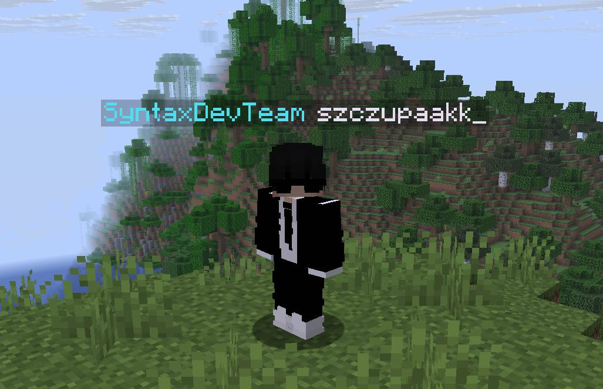
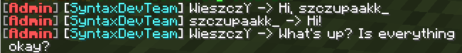

# 🏷️ TagsX

## Overview
TagsX is a polished and lightweight Minecraft server plugin that empowers administrators to curate a catalog of personalized tags and lets players adopt them through an intuitive in-game interface. The plugin stores selections automatically, supports dynamic PlaceholderAPI integration, and keeps management simple thanks to its fully file-driven configuration.

## Key Features
- **Interactive tag selection** – Players open a streamlined GUI with `/tags` and pick their preferred flair in just a few clicks.
- **Config-driven management** – Administrators define tags, icons, and permissions directly in `config.yml`, with changes applied instantly via `/tagsx reload`.
- **Persistent player choices** – Each selection is saved in `tags.yml`, ensuring tags remain active between sessions.
- **PlaceholderAPI ready** – Use `%tagsx_tag%` anywhere PlaceholderAPI is supported to surface the active tag in chat, scoreboards, or other plugins.

## Commands
| Command | Description | Permission |
|---------|-------------|------------|
| `/tags` | Opens the tags selection GUI (available to all players) | `tagsx.command.tags` |
| `/tagsx reload` | Reloads the plugin configuration | `tagsx.reload` |

## Permissions
- `tagsx.command.tags` — Grants access to the `/tags` GUI.
- `tagsx.reload` — Allows reloading the plugin configuration with `/tagsx reload`.

## Configuration
Define every available tag in `./plugins/TagsX/config.yml`:

```yaml
 tags:
   name1:
     display-name: "§bname1"
     display: "§bNAME1"
     material: "BLUE_DYE"
     permission: "tag.name1"

   name2:
     display-name: "§dNAME2"
     display: "§dNAME2"
     material: "BLACK_DYE"
     permission: "tag.name2"
```

Each tag entry requires a unique identifier, a display name (shown in menus), an icon material, and an optional permission gate.

## Player Experience
1. Run `/tags` to open the interactive GUI.
2. Browse the available tags and select a favorite.
3. The choice is stored automatically in `tags.yml`.
4. Display the active tag anywhere with the `%tagsx_tag%` PlaceholderAPI placeholder.

## PlaceholderAPI Integration
| Placeholder | Description |
|-------------|-------------|
| `%tagsx_tag%` | Resolves to the player's currently selected tag |

## Screenshots
| In-game | Chat Integration |
|-------------|-----------------|
|  |  |

---
⭐ **TagsX is the perfect solution for personalizing player identities and elevating the atmosphere on your Minecraft server.**
